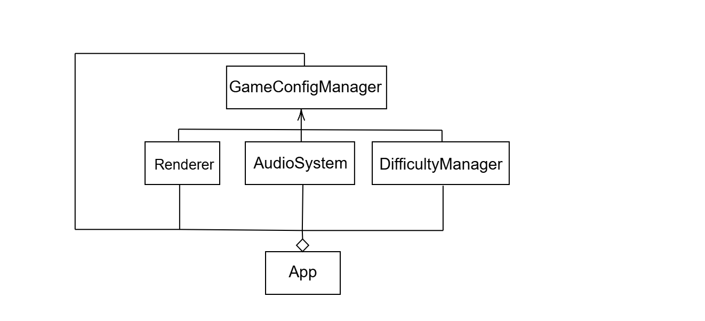

# Singleton Pattern Demo - Java

A demonstration of the **Singleton design pattern** implemented in Java. This project includes modern Java development practices and best software engineering practices including testing, code coverage etc.

### Real-World Applications

The Singleton pattern is commonly used in:

- **Configuration management** (e.g., game configuration, app settings)
- **Logging frameworks** (ensuring all parts of the system use the same logger)
- **Database connections** (ensuring only one connection manager exists)

## 🏗️ Design

This project defines a Game Configuration Manager that demonstrates the Singleton pattern.
The **GameConfigManager** class ensures only one instance of the configuration exists and provides a consistent way for multiple subsystems (such as Renderer, AudioSystem, and DifficultyManager) to access and use game settings.

### Key Components

- **`GameConfigManager`** - The Singleton class that ensures only one instance exists and provides global access to configuration settings.
- **`Renderer`** - A subsystem that uses the shared configuration.
- **`AudioSystem`** - Another subsystem that depends on the same configuration instance.
- **`DifficultyManager`** - Game logic component demonstrating the use of Singleton for loading levels.
- **`App`** - Demonstration class showing how all components share the same Singleton instance.
- **Comprehensive test suite** - Validates pattern implementation

## UML Diagram



### Prerequisites

- **Java 17** or higher
- **Maven 3.8** or higher
- **Git** for version control

### Installation

1. **Clone the repository:**

   ```bash
   git clone https://github.com/112201048/SWE-CS5617-112201048.git
   cd Individual_Assignment/GameConfig
   ```

2. **Compile the project:**

   ```bash
   mvn clean compile
   ```

3. **Run the tests:**

   ```bash
   mvn test
   ```

4. **Run the demonstration:**
   ```bash
    mvn exec:java -pl Game "-Dexec.mainClass=game.App"
   ```

## 🔧 Build Commands

### Essential Maven Commands

| Command                | Description                       |
| ---------------------- | --------------------------------- |
| `mvn clean compile`    | Clean and compile the source code |
| `mvn test`             | Run all unit tests                |
| `mvn checkstyle:check` | Run code style checks             |
